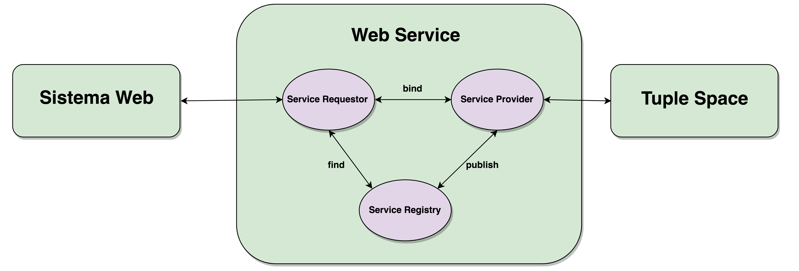

# Web Service

## Descrição
O primeiro middleware a ser utilizado é o Web Service.
A seguir, listaremos os principais componentes da arquitetura de um serviço WEB.

- **Sistema Web**: Sistema de interação com o usuário. De maneira geral, a implementação desse sistema fica a cargo de quem for utilizar o serviço.
- **Service Requestor**: Cliente do Serviço, pode ser escrito em qualquer linguagem, neste projeto, escolhemos escrever o cliente em PHP.
- **Service Registry**: Responsável por prover acesso ao UDDI. O UDDI serve para que a aplicação cliente localize o Web Service.
- **Service Provider**: O *Provider* é responsável por implementar o serviço propriamente dito, além disso, deve torná-lo disponível, publicando no *Service Registry*.

## PASSO-A-PASSO para executar
1) Abra o Terminal na pasta TicketNowWS/dist/
2) Digite: _java -cp TicketNowWS.jar ticketnowws.TicketNowPublisher_ no terminal para executar o Servidor Web.

* O Serviço Web é configurado através do arquivo _config_WebService.txt_.
* O cliente do Espaço de Tuplas é configurado através do arquivo _config_TupleSpace.txt_.